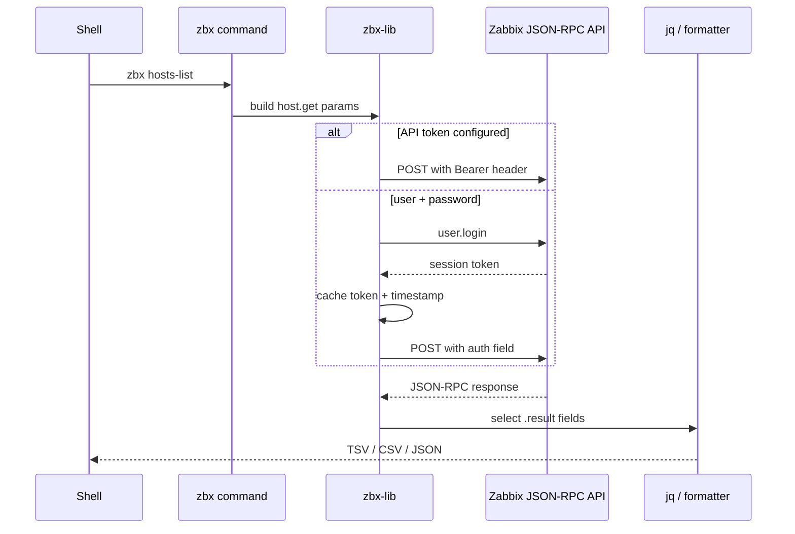
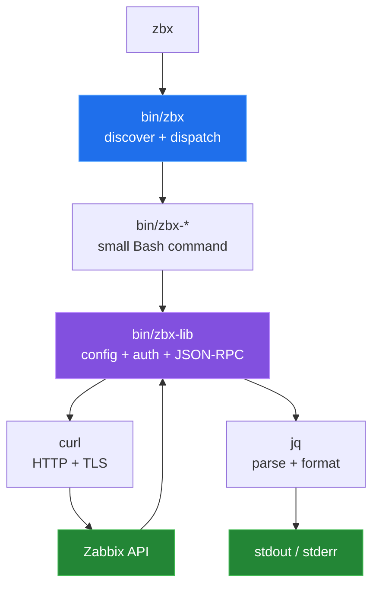

# zbx-cli


> Pure-shell Zabbix CLI for hosts where Python is unavailable or forbidden — git-style subcommands, TSV/CSV/JSON output, composable with standard Unix tools.

`zbx` is a pure-shell client for the Zabbix JSON-RPC API: one dispatcher,
small `zbx-*` commands, `curl` for transport, and `jq` for request and output
shaping. It is useful when a host already has Bash, `curl`, and `jq`, and the
desired workflow is to compose TSV, CSV, or JSON with ordinary Unix tools.



## Why

The official Zabbix tooling requires Python. On locked-down servers, OT hosts, or minimal containers there may be no Python interpreter, no pip, and no desire to install one. zbx-cli is a collection of bash scripts that talk to the Zabbix JSON-RPC API using only `curl` and `jq`. Because every subcommand writes plain text to stdout, output pipes naturally into `awk`, `grep`, `cut`, and other Unix primitives already present on the host.

## Quick start

```bash
# System-wide install
make install

# Or install without root
make install-user   # installs to ~/.local/bin

# Configure
zbx config init
zbx config set ZABBIX_URL https://zabbix.example.com/api_jsonrpc.php
zbx config set ZABBIX_USER apiuser
zbx config set ZABBIX_PASS secret123

# Verify
zbx ping            # prints "pong"
zbx version         # shows API version and authenticated user

# Common operations
zbx hosts-list
zbx problems
zbx search hosts web --format csv --headers
zbx macro-set web01 '{ENV}' prod
zbx ack 12345 "Investigating"
```

`make install` into a temporary prefix and `zbx --list` were checked in a
Linux container. The commands that contact `zabbix.example.com` need your real
endpoint and credentials; `doctor`, `ping`, and the data commands have not been
run against a server.
For session authentication, set `ZABBIX_USER` and `ZABBIX_PASS` instead of
`ZABBIX_API_TOKEN`. See [configuration and authentication](docs/configuration.md)

## How it works

- `bin/zbx` — dispatcher, git-style. Discovers all `zbx-*` executables on `$PATH` and delegates to them. Handles global flags (`--insecure`, `--cacert`, `--capath`) before dispatch.
- `bin/zbx-lib` — shared library: authentication, session token caching (30-minute lifetime; falls back to API token mode via `ZABBIX_API_TOKEN`), and the `zbx_call` JSON-RPC helper.
- `bin/zbx-call` — low-level JSON-RPC invoker; accepts params on stdin and an optional `jq` filter argument. Useful for ad-hoc API calls.
- Subcommands cover hosts, templates, macros, problems, triggers, maintenance windows, items, history, trends, discovery, and inventory.
- `tools/gen-completions.sh` generates Bash tab-completions from each subcommand's `-h` output.
- `tests/` — unit tests using a mock `curl` shim; integration tests run against a real Zabbix endpoint (read-only).

## Architecture



`bin/zbx` recognizes executable `zbx-*` commands on `PATH`. The subcommands
source the shared libraries, make a JSON request with `jq`, call the endpoint,
and select output fields. The dispatcher also handles `--insecure`, `--cacert`,
and `--capath` before dispatching.

## Capabilities

| Area | Representative commands | API work | Typical output |
|---|---|---|---|
| Hosts | `hosts-list`, `host-get`, `host-create`, `host-enable`, `host-del` | Read and mutate hosts, interfaces, groups, and status. | TSV or JSON |
| Templates | `template-list`, `template-link`, `template-unlink` | List and link or unlink templates. | TSV or JSON |
| Macros | `macro-get`, `macro-set`, `macro-bulk-set`, `macro-del` | Read and update host user macros. | TSV or JSON |
| Problems and triggers | `problems`, `ack`, `triggers`, `trigger-enable` | Inspect current problems and change acknowledgement or trigger status. | TSV or JSON |
| Maintenance | `maint-list`, `maint-create`, `maint-del` | Read, create, and delete maintenance windows. | TSV or JSON |
| History and inventory | `item-find`, `history`, `trends`, `discovery`, `inventory` | Query item data, discovery items, and host inventory. | TSV, CSV, or JSON |
| Search | `search` | Search hosts, groups, templates, items, triggers, problems, or macros. | TSV, CSV, or JSON |
| Health and auth | `doctor`, `login`, `ping`, `version` | Check local prerequisites, authenticate, and inspect API/user identity. | Text or JSON |
| Extensibility | `call` | Send arbitrary JSON-RPC params and optionally apply a `jq` filter. | API result or raw JSON |

The complete source-derived command surface is in
[`docs/commands.md`](docs/commands.md). It is regenerated by
[`devtools/generate-command-table.sh`](devtools/generate-command-table.sh).

## Configuration

Config file at `~/.config/zbx/config.sh` (user) or `/etc/zbx/config.sh` (system). Manage with `zbx config`:

| Variable | Description |
|---|---|
| `ZABBIX_URL` | Full JSON-RPC endpoint URL |
| `ZABBIX_USER` / `ZABBIX_PASS` | Credentials for session auth |
| `ZABBIX_API_TOKEN` | Bearer token (skips session auth) |
| `ZABBIX_VERIFY_TLS` | `1` (default) or `0` to skip TLS verification |
| `ZABBIX_CA_CERT` | Path to custom CA certificate |
| `ZABBIX_TOKEN_FILE` | Override session token cache path |

## Results

All results come from [`devtools/linux-run.sh`](devtools/linux-run.sh), run in
a `python:3.12-slim-bookworm` container on a fresh clone. They are repository
measurements and mock tests, not API benchmarks:

| Measurement | Result |
|---|---:|
| User-facing command source files | 34 |
| Bytes in those command files | 59,770 |
| Lines in those command files | 1,755 |
| Bytes in all `bin/*` files | 79,103 |
| Shell test files | 18 |
| `make test` in a fresh clone | 16 pass, 2 skipped |

The 16 mock test files use `tests/mock-bin/curl`, which records every request
so the tests can check the exact API method and parameters of each read and
write subcommand. They also cover usage and not-found errors, API errors,
session login and token expiry, and a regression test for each fixed bug. The
two integration tests are skipped unless `ZABBIX_URL` is set. Run the suite in
a Debian container with `sh tests/docker.sh`. The fixed bugs are re-checked in
the same run. See
[`docs/measurement.md`](docs/measurement.md) for the full output.

## Repository layout

| Path | Purpose |
|---|---|
| `bin/zbx` | Dispatcher, help system, and global TLS flags. |
| `bin/zbx-*` | User-facing subcommands plus the sourced libraries. |
| `Makefile` | System/user installation, tests, checks, and completions. |
| `tests/` | Mock-based unit tests and opt-in read-only integration tests. |
| `tools/` | Repository-maintained completion generation. |
| `devtools/` | Command-table generation, measurements, and the Linux run. |
| `docs/` | Architecture, command surface, configuration, failures, and provenance. |
| `ARCHITECTURE.md` | Existing prose architecture reference. |
| `OPTIMISATIONS.md` | Existing implementation notes. |

Start with the [documentation index](docs/README.md).

## Known limitations

> **Behaviour change.** A JSON-RPC error returned under API-token
> authentication used to be treated as a successful response: `ping` could
> print `pong` and `version` could print null fields. `zbx_call` now returns a
> non-zero status for structured API errors, so scripts that relied on the old
> always-success behaviour in token mode will start seeing failures.

- The client does not enforce a supported Zabbix API-version range. `ping`
  checks the call path, while `version` prints the API's returned value.
- The dispatcher needs a modern Bash for its associative-array and `mapfile`
  features.
- Commands that need a server cannot be fully verified without a real Zabbix
  endpoint and credentials or an API token. The integration tests are skipped
  when `ZABBIX_URL` is absent.
- Configuration files are sourced as shell code. Keep them private and use the
  redacted `zbx config list`/`get` views when sharing diagnostics.
- `--insecure` disables TLS verification for the invoked run. Prefer a trusted
  CA or `ZABBIX_CA_CERT`/`ZABBIX_CA_PATH` for normal operation.
- Subcommands that take a host or ID read `--format` and `--headers` only
  before those arguments: `zbx triggers --format json web01`.

## Status

Actively maintained.

## License

MIT
