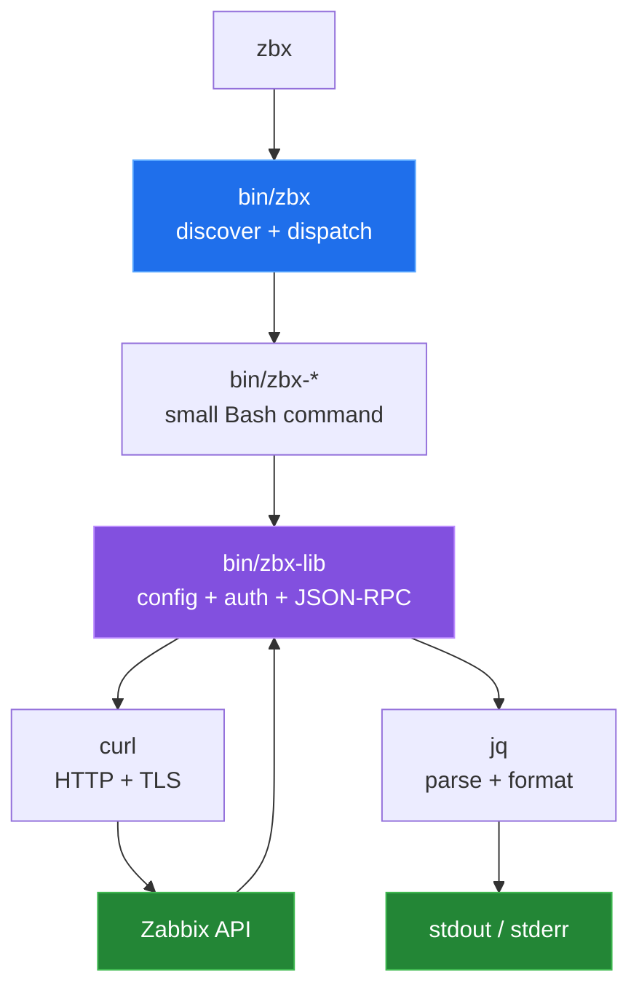

# Zabbix CLI (`zbx`)

`zbx` is a pure-shell client for the Zabbix JSON-RPC API: one dispatcher,
small `zbx-*` commands, `curl` for transport, and `jq` for request and output
shaping. It is useful when a host already has Bash, `curl`, and `jq`, and the
desired workflow is to compose TSV, CSV, or JSON with ordinary Unix tools.

```mermaid
sequenceDiagram
    participant S as Shell
    participant Z as zbx command
    participant L as zbx-lib
    participant A as Zabbix JSON-RPC API
    participant J as jq / formatter

    S->>Z: zbx hosts-list
    Z->>L: build host.get params
    alt API token configured
        L->>A: POST with Bearer header
    else user + password
        L->>A: user.login
        A-->>L: session token
        L->>L: cache token + timestamp
        L->>A: POST with auth field
    end
    A-->>L: JSON-RPC response
    L->>J: select .result fields
    J-->>S: TSV / CSV / JSON

    style Z fill:#1f6feb,stroke:#58a6ff,color:#fff
    style L fill:#8250df,stroke:#bc8cff,color:#fff
    style A fill:#238636,stroke:#3fb950,color:#fff
    style J fill:#238636,stroke:#3fb950,color:#fff
```

## Quick start

Requirements: a modern Bash, `curl`, and `jq`. Install the scripts for the
current user, then configure either a Zabbix API token or user/password
credentials:

```sh
make install-user

export ZABBIX_API_TOKEN='replace-with-your-api-token'
zbx config init --scope user
zbx config set ZABBIX_URL \
  https://zabbix.example.com/api_jsonrpc.php --scope user
zbx config set ZABBIX_API_TOKEN "$ZABBIX_API_TOKEN" --scope user

zbx doctor
zbx ping
zbx hosts-list --headers
zbx search hosts web --format csv --headers
```

The install and config commands were checked in a temporary local install
prefix. The commands that contact `zabbix.example.com` require your real
endpoint and credentials; no live Zabbix endpoint was available for this pass,
so `doctor`, `ping`, and the data commands were not verified against a server.
For session authentication, set `ZABBIX_USER` and `ZABBIX_PASS` instead of
`ZABBIX_API_TOKEN`. See [configuration and authentication](docs/configuration.md)
for the full variable table.

## Architecture



`bin/zbx` recognizes executable `zbx-*` commands on `PATH`. The subcommands
source the shared libraries, make a JSON request with `jq`, call the endpoint,
and select output fields. The dispatcher also handles `--insecure`, `--cacert`,
and `--capath` before dispatching.

## Capabilities

| Area | Representative commands | API work | Typical output |
|---|---|---|---|
| Hosts | `hosts-list`, `host-get`, `host-create`, `host-enable`, `host-del` | Read and mutate hosts, interfaces, groups, and status. | TSV or JSON |
| Templates | `template-list`, `template-link`, `template-unlink` | List and link or unlink templates. | TSV or JSON |
| Macros | `macro-get`, `macro-set`, `macro-bulk-set`, `macro-del` | Read and update host user macros. | TSV or JSON |
| Problems and triggers | `problems`, `ack`, `triggers`, `trigger-enable` | Inspect current problems and change acknowledgement or trigger status. | TSV or JSON |
| Maintenance | `maint-list`, `maint-create`, `maint-del` | Read, create, and delete maintenance windows. | TSV or JSON |
| History and inventory | `item-find`, `history`, `trends`, `discovery`, `inventory` | Query item data, discovery items, and host inventory. | TSV, CSV, or JSON |
| Search | `search` | Search hosts, groups, templates, items, triggers, problems, or macros. | TSV, CSV, or JSON |
| Health and auth | `doctor`, `login`, `ping`, `version` | Check local prerequisites, authenticate, and inspect API/user identity. | Text or JSON |
| Extensibility | `call` | Send arbitrary JSON-RPC params and optionally apply a `jq` filter. | API result or raw JSON |

The complete source-derived command surface is in
[`docs/commands.md`](docs/commands.md). It is regenerated by
[`devtools/generate-command-table.sh`](devtools/generate-command-table.sh).

## Measured results

These are local repository measurements from
[`devtools/measure.sh`](devtools/measure.sh), not API benchmarks:

| Measurement | Result |
|---|---:|
| User-facing command source files | 34 |
| Bytes in those command files | 59,733 |
| Lines in those command files | 1,754 |
| Bytes in all `bin/*` files | 79,036 |
| Shell test files | 12 |
| Live Zabbix request benchmark | not measured |

The integration tests intentionally require a configured, reachable endpoint.
No network timing or API-version compatibility number is published without one.
The measurement method and provenance are documented in
[`docs/measurement.md`](docs/measurement.md).

## Repository layout

| Path | Purpose |
|---|---|
| `bin/zbx` | Dispatcher, help system, and global TLS flags. |
| `bin/zbx-*` | User-facing subcommands plus the sourced libraries. |
| `Makefile` | System/user installation, tests, checks, and completions. |
| `tests/` | Mock-based unit tests and opt-in read-only integration tests. |
| `tools/` | Repository-maintained completion generation. |
| `devtools/` | Command-table generation and measurements created for this pass. |
| `docs/` | Architecture, command surface, configuration, failures, and provenance. |
| `ARCHITECTURE.md` | Existing prose architecture reference. |
| `OPTIMISATIONS.md` | Existing implementation notes. |

Start with the [documentation index](docs/README.md).

## Known limitations

- The client does not enforce a supported Zabbix API-version range. `ping`
  checks the call path, while `version` prints the API's returned value.
- With API-token authentication, a JSON-RPC error is currently treated as a
  successful JSON response by `zbx_call`; `ping` can print `pong` for such an
  error and `version` can print null fields.
- `zbx doctor` can display `HTTP 000000` for an unreachable endpoint because
  its unavailable-status fallback is appended twice.
- The dispatcher lists the installed internal `zbx-lib` helper as `lib`, and
  the dispatcher needs a modern Bash for its associative-array and mapfile
  features.
- The tracked mock `curl` used by the shell tests is not executable in a raw
  checkout, so mock tests can fall through to the real network command.
- Commands that need a server cannot be fully verified without a real Zabbix
  endpoint and credentials or an API token. The integration tests fail early
  when `ZABBIX_URL` is absent by design.
- Configuration files are sourced as shell code. Keep them private and use the
  redacted `zbx config list`/`get` views when sharing diagnostics.
- `--insecure` disables TLS verification for the invoked run. Prefer a trusted
  CA or `ZABBIX_CA_CERT`/`ZABBIX_CA_PATH` for normal operation.
- The tracked source scripts are installed with executable permissions by the
  Makefile; when using the checkout directly, invoke the dispatcher as `bash
  bin/zbx ...` unless the files have been made executable locally.
