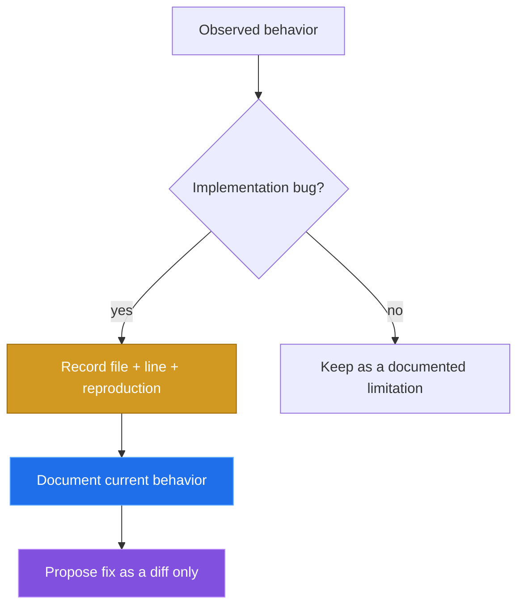

# Bugs found

[← back to the overview](../README.md)

This pass did not change the implementation. The findings below are recorded
so the documented behavior stays honest and a later code change can be reviewed
separately.



## Internal library appears as a command

**Location:** `bin/zbx:15-17`, `_list_subcommands`.

**What happens:** the dispatcher lists every `zbx-*` executable on `PATH`, so
an installed `zbx-lib` is shown as the user-facing command `lib`. The library
is sourced by subcommands and is not intended as a command. The source-derived
table deliberately excludes it.

**Reproduction:** install into a temporary prefix, use a modern Bash on `PATH`,
and run:

```sh
make install PREFIX="$prefix" SYSCONFDIR="$prefix/etc"
PATH="$prefix/bin:$PATH" zbx --list | grep '^lib$'
```

The command prints `lib`.

**Proposed fix:** exclude the internal library during discovery.

```diff
diff --git a/bin/zbx b/bin/zbx
@@
   compgen -c \
   | grep -E '^zbx-' \
+  | grep -v '^zbx-lib$' \
   | sort -u
```

## Dispatcher requires a modern Bash

**Location:** `bin/zbx:56`, the associative `_FALLBACK_DESC` declaration.

**What happens:** when the shebang resolves to the older system Bash on this
machine, the associative-array syntax is not supported. The dispatcher exits
at the declaration with an `unbound variable` error before `--list` can run.
The README previously named Bash without stating this compatibility boundary.

**Reproduction:** install into a temporary prefix, then deliberately put only
the system shell directories on `PATH`:

```sh
make install PREFIX="$prefix" SYSCONFDIR="$prefix/etc"
PATH="$prefix/bin:/usr/bin:/bin" "$prefix/bin/zbx" --list
```

On this machine that exits at `bin/zbx:56` with `zbx: unbound variable`. The
same installed command works when the newer Bash is first on `PATH`.

**Proposed fix:** either state the minimum supported Bash version and check it
before using associative arrays, or replace the associative array and
`mapfile` usage with constructs supported by the declared minimum.

```diff
diff --git a/bin/zbx b/bin/zbx
@@
 #!/usr/bin/env bash
 set -euo pipefail
 # shellcheck disable=SC1007,SC2015,SC1090,SC1091
+if (( BASH_VERSINFO[0] < 4 )); then
+  echo 'zbx requires Bash 4 or newer.' >&2
+  exit 2
+fi
```

## Mock curl is not executable in the checkout

**Location:** `tests/mock-bin/curl` (mode `0644`), used by the PATH setup in
`tests/test_doctor.sh:7-8`, `tests/test_hosts.sh:7-8`, and the other mock tests.

**What happens:** the tests put `tests/mock-bin` first on `PATH`, but the shell
cannot execute the tracked mock because its mode is not executable. The tests
fall through to a real `curl`, which makes mock tests depend on the local
network and can turn a fast test run into endpoint timeouts.

**Reproduction:** from the checkout, run:

```sh
make test
```

With no reachable configured endpoint, the mock-oriented tests attempt the
real endpoint instead of the JSON responses in `tests/mock-bin/curl`.

**Proposed fix:** make only the mock executable.

```diff
diff --git a/tests/mock-bin/curl b/tests/mock-bin/curl
old mode 100644
new mode 100755
```

## API-token errors bypass structured error handling

**Location:** `bin/zbx-lib:207`, the early return in `zbx_call`.

**What happens:** with `ZABBIX_API_TOKEN` set, any valid JSON response is
returned with status zero before the later `.error` check. A JSON-RPC error can
therefore make `zbx ping` print `pong`; `zbx version` prints `api.version:
null` and an empty user line without a diagnostic.

**Reproduction:** the following shell function stands in for `curl` and returns
a JSON-RPC error without changing any repository file:

```sh
curl() { jq -n '{jsonrpc:"2.0",error:{code:-32600,message:"unsupported API version"},id:1}'; }
export -f curl
export ZABBIX_API_TOKEN=dummy
bash bin/zbx-ping
bash bin/zbx-version
```

The observed output is `pong` for `zbx-ping`, and `api.version: null` followed
by an empty `user:` line for `zbx-version`; both commands exit successfully.

**Proposed fix:** inspect the JSON-RPC error before the token-mode success
return, log it, and return failure to the caller.

```diff
diff --git a/bin/zbx-lib b/bin/zbx-lib
@@
-  if [ -n "${ZABBIX_API_TOKEN:-}" ]; then printf '%s' "$resp"; return 0; fi
-  if jq -e '.error.message? | test("Session terminated|Not authorised"; "i")' >/dev/null 2>&1 <<<"$resp"; then
+  if [ -z "${ZABBIX_API_TOKEN:-}" ] && jq -e '.error.message? | test("Session terminated|Not authorised"; "i")' >/dev/null 2>&1 <<<"$resp"; then
     log_warn "Session terminated; re-login and retry once"
     zbx_login
     resp=$(printf '%s' "$input" | zbx_call_raw "$method")
   fi
@@
   if jq -e '.error? // empty' >/dev/null 2>&1 <<<"$resp"; then
     log_error "API error: $(jq -c '.error' <<<"$resp")"
     log_info "Run 'zbx doctor' to diagnose common issues."
+    return 1
   fi
```

## Doctor duplicates the unavailable HTTP status marker

**Location:** `bin/zbx-doctor:184`, the deep connectivity probe.

**What happens:** when `curl` fails before producing an HTTP status, the
`-w '%{http_code}'` path can already emit `000`, and the `|| echo 000` fallback
adds another copy. The report can therefore say `HTTP 000000 from endpoint`
instead of the intended unavailable marker.

**Reproduction:** point the doctor at a closed local port:

```sh
ZABBIX_URL=http://127.0.0.1:9/api_jsonrpc.php \
ZABBIX_API_TOKEN=dummy ZABBIX_CURL_TIMEOUT=1 bash bin/zbx-doctor
```

The endpoint line reports `HTTP 000000 from endpoint` on this machine.

**Proposed fix:** keep the curl write-out value and use the fallback only when
the command produced no marker.

```diff
diff --git a/bin/zbx-doctor b/bin/zbx-doctor
@@
-    http_code=$(_zbx_curl_common -w '%{http_code}' -o "$tmp_resp" -sS -X POST "$ZABBIX_URL" -d "$req" 2>/dev/null || echo 000)
+    http_code=$(_zbx_curl_common -w '%{http_code}' -o "$tmp_resp" -sS -X POST "$ZABBIX_URL" -d "$req" 2>/dev/null || true)
+    [ -n "$http_code" ] || http_code=000
```
