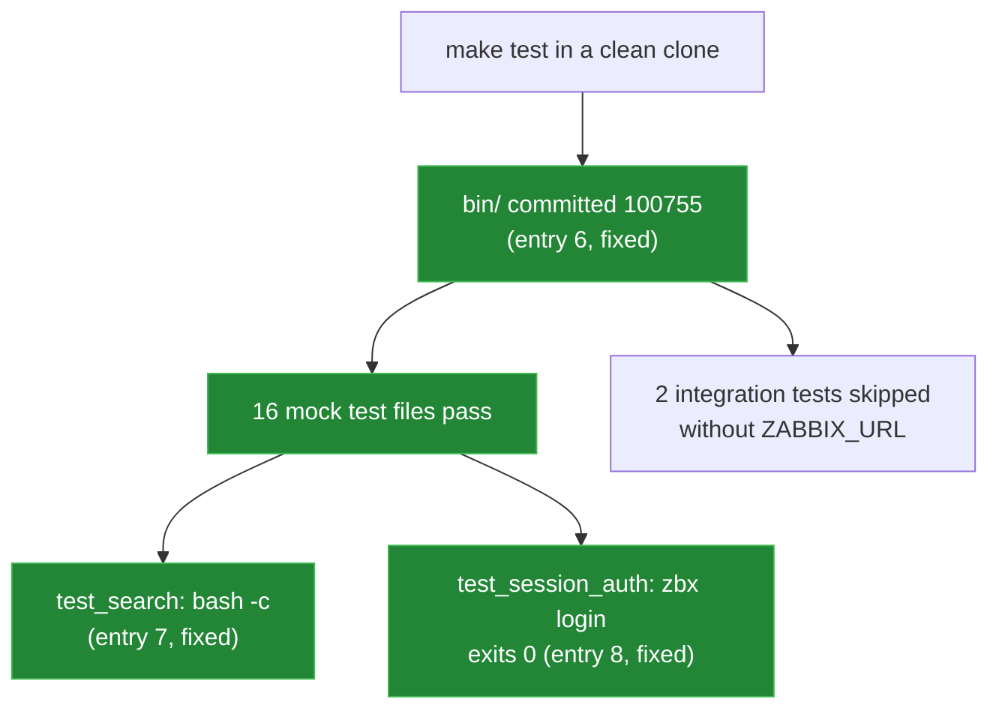

# Bugs found

[← back to the overview](../README.md)

Each entry below was reproduced and reviewed. Seven are fixed, and one was
rejected as a documented requirement. Entries 6 and 7 turned up when everything
was re-run in a Linux container (see
[measurement and provenance](measurement.md)), and entry 8 was found by the
session-mode test added with those fixes. Entries 6 to 8 each have a
regression test under [`tests/`](../tests).

| # | Entry | Status |
|---|---|---|
| 1 | Internal library appears as a command | Fixed in [`8d62584`](https://github.com/Bissbert/zbx-cli/commit/8d62584) |
| 2 | Dispatcher requires a modern Bash | Not a bug: documented requirement |
| 3 | Mock curl is not executable | Fixed in [`cc06e2e`](https://github.com/Bissbert/zbx-cli/commit/cc06e2e) |
| 4 | API-token errors bypass error handling | Fixed in [`b33ad37`](https://github.com/Bissbert/zbx-cli/commit/b33ad37) |
| 5 | Doctor duplicates the unavailable HTTP marker | Fixed in [`e0cb555`](https://github.com/Bissbert/zbx-cli/commit/e0cb555) |
| 6 | `bin/` scripts are committed without the executable bit | Fixed in [`7679018`](https://github.com/Bissbert/zbx-cli/commit/7679018) |
| 7 | `test_search.sh` loses the mock `curl` in a login shell | Fixed in [`7679018`](https://github.com/Bissbert/zbx-cli/commit/7679018) |
| 8 | `zbx login` exits 1 after a successful session login | Fixed in [`7679018`](https://github.com/Bissbert/zbx-cli/commit/7679018) |

The checks below run inside the container that
[`devtools/linux-run.sh`](../devtools/linux-run.sh) sets up
(`python:3.12-slim-bookworm`, GNU bash 5.2.15, curl 7.88.1, jq 1.6), in a
`git clone` of the repository so the file modes are the committed ones.



## 1. Internal library appears as a command

**Status:** fixed in [`8d62584`](https://github.com/Bissbert/zbx-cli/commit/8d62584).

**File:** `bin/zbx` (`_list_subcommands`)

**What happened:** the dispatcher listed every `zbx-*` executable on `PATH`.
`make install` installs the sourced library `zbx-lib` with mode `0755`, so
`zbx --list` showed it as the command `lib`.

**What changed:** discovery filters out `zbx-lib`. Other `zbx-*` commands,
including external extensions, are still listed.

**Check:**

```sh
make install PREFIX=/tmp/prefix SYSCONFDIR=/tmp/prefix/etc
PATH=/tmp/prefix/bin:$PATH zbx --list
```

```
commands listed: 34, lib listed: 0
```

## 2. Dispatcher requires a modern Bash

**Status:** not a bug. The entry was reviewed and rejected; nothing was
changed.

**File:** `bin/zbx:56` (associative `_FALLBACK_DESC`), `bin/zbx:146` (`mapfile`)

**What was reported:** under macOS's `/bin/bash` 3.2 the dispatcher stops at
line 56 with `zbx: unbound variable`.

**Why it was rejected:** the README's known limitations say that `zbx` needs a
modern Bash, and
3.2 is outside that requirement. A version check with a clearer message would
help, but rewriting for Bash 3 is not planned. Current Linux distributions ship Bash 5;
the Linux run uses 5.2.15.

## 3. Mock curl is not executable

**Status:** fixed in [`cc06e2e`](https://github.com/Bissbert/zbx-cli/commit/cc06e2e).

**Files:** `tests/mock-bin/curl`, `tests/test_doctor.sh`

**What happened:** the mock was committed with mode `0644`, so the tests that
put `tests/mock-bin` first on `PATH` still ran the real `curl`.

**What changed:** the mock is mode `0755`, and `test_doctor.sh` asserts that
`command -v curl` resolves to it.

**Check:**

```
-rwxr-xr-x tests/mock-bin/curl
/tmp/zbx/tests/mock-bin/curl
```

## 4. API-token errors bypass error handling

**Status:** fixed in [`b33ad37`](https://github.com/Bissbert/zbx-cli/commit/b33ad37).

**File:** `bin/zbx-lib` (`zbx_call`)

**What happened:** with `ZABBIX_API_TOKEN` set, `zbx_call` returned any valid
JSON with status 0 before checking `.error`. A JSON-RPC error made `zbx ping`
print `pong` and exit 0.

**What changed:** the session re-login retry only runs in session mode, and a
structured API error is logged and returns 1 in both modes. Scripts that relied
on the old exit 0 in token mode now see a failure.

**Check:** a shell function stands in for `curl` and returns a JSON-RPC error:

```sh
curl() { jq -n '{jsonrpc:"2.0",error:{code:-32600,message:"unsupported API version"},id:1}'; }
export -f curl
ZABBIX_URL=http://mock.invalid/api_jsonrpc.php ZABBIX_API_TOKEN=dummy bash bin/zbx-ping
ZABBIX_URL=http://mock.invalid/api_jsonrpc.php ZABBIX_API_TOKEN=dummy bash bin/zbx-version
```

```
zbx-ping exit=1 stdout=[]
API error: {"code":-32600,"message":"unsupported API version"}
zbx-version exit=1 stdout=[api.version: null ]
API error: {"code":-32600,"message":"unsupported API version"}
```

`zbx-version` still prints `api.version: null` before it fails, but it now
logs the error and exits 1.

## 5. Doctor duplicates the unavailable HTTP marker

**Status:** fixed in [`e0cb555`](https://github.com/Bissbert/zbx-cli/commit/e0cb555).

**File:** `bin/zbx-doctor` (deep connectivity probe)

**What happened:** when `curl` failed before a response, `-w '%{http_code}'`
already printed `000` and the `|| echo 000` fallback added a second copy. The
status became `000000`, which matched none of the `case` branches.

**What changed:** the fallback only sets `000` when the captured value is
empty.

**Check:**

```sh
ZABBIX_URL=http://127.0.0.1:9/api_jsonrpc.php ZABBIX_API_TOKEN=dummy \
  ZABBIX_CURL_TIMEOUT=1 bash bin/zbx-doctor
```

```
 - apiinfo.version [warn] failed (check URL/TLS/auth)
 - endpoint     [warn] Unable to reach endpoint — check URL and connectivity
lines containing 000000: 0
```

The `000` value now reaches the network branch and gets its message.

## 6. `bin/` scripts are committed without the executable bit

**Status:** fixed in [`7679018`](https://github.com/Bissbert/zbx-cli/commit/7679018) ([#4](https://github.com/Bissbert/zbx-cli/issues/4)).

**Files:** all 37 files in `bin/` (git mode `100644`); the tests that run
`"$ROOT/bin/zbx"` directly

**What happened:** `make install` sets mode `0755`, but a fresh clone had
none of `bin/` executable. The nine mock test files that failed call
`$ROOT/bin/zbx` directly, which exited 126 (permission denied):

```
make test (committed modes)
Summary: 1 passed, 11 failed
--- test_doctor.sh stderr
ASSERT_EQ failed: doctor exit
  expected: 0
  got:      126
```

The README's workaround for the checkout, `bash bin/zbx ...`, did not avoid
this: the dispatcher runs each subcommand as a separate executable.

```
bash bin/zbx config --help exit=126
bin/zbx: line 286: /tmp/zbx/bin/zbx-config: Permission denied
```

**What changed:** all 37 files in `bin/` are committed with mode `100755`.
`tests/test_file_modes.sh` checks the git mode of every file in `bin/` and
`tests/mock-bin/` and runs `bash bin/zbx config --help`. The Linux run now
shows:

```
100755 38 files, e.g. bin/log-lib
bash bin/zbx config --help exit=0
```

## 7. `test_search.sh` loses the mock `curl` in a login shell

**Status:** fixed in [`7679018`](https://github.com/Bissbert/zbx-cli/commit/7679018) ([#5](https://github.com/Bissbert/zbx-cli/issues/5)).

**File:** `tests/test_search.sh:15`

**What happened:** the second check ran
`bash -lc "printf '{}' | '$ROOT/bin/zbx' call apiinfo.version"`. `-l` makes
Bash read `/etc/profile`, and Debian's `/etc/profile` sets `PATH` to a fixed
value. `tests/mock-bin` was dropped, `zbx call` ran the real `curl`, and the
check failed:

```
ASSERT_EQ failed: zbx call exit
  expected: 0
  got:      1
--- curl seen by the login shell that test_search.sh starts
/usr/bin/curl
```

**What changed:** the check uses `bash -c`. `tests/test_no_login_shell.sh`
fails if any test starts a login shell, and checks that a child shell still
resolves `curl` to `tests/mock-bin/curl`.

## 8. `zbx login` exits 1 after a successful session login

**Status:** fixed in [`7679018`](https://github.com/Bissbert/zbx-cli/commit/7679018) ([#6](https://github.com/Bissbert/zbx-cli/issues/6)). Found by the session-mode test added
with the fixes for entries 6 and 7.

**File:** `bin/zbx-lib:68` (`log_debug` fallback)

**What happened:** `zbx_login` ends with `log_debug "Session token cached"`.
The `log_debug` that `zbx-lib` defines was
`[ "${LOG_LEVEL:-}" = "debug" ] && echo ...`, which returns 1 at any level
other than `debug`, so `zbx_login` returned 1. `zbx-login` runs
`zbx_login && echo ok`: with a user and password the session token was cached,
but `ok` was not printed and the exit status was 1. API-token mode returns
before that line and was not affected.

**What changed:** the fallback `log_debug` returns 0.
`tests/test_session_auth.sh` logs in against the mock API, then checks the
cached token and its mode, token reuse, re-login after expiry and a failed
login. The Linux run now shows:

```
exit=0 stdout=[ok]
cached token: sess-0123
```
