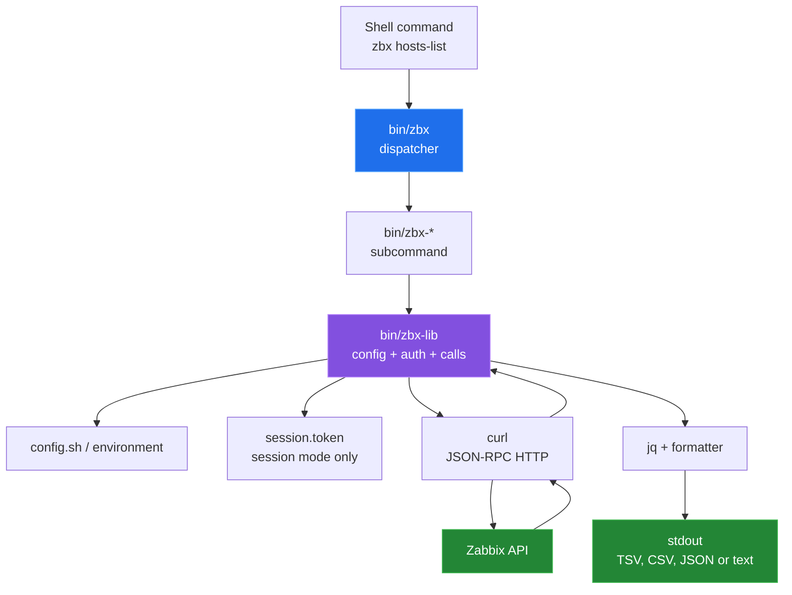

# Architecture

[← back to the overview](../README.md)

`zbx` is a dispatcher around small Bash programs. The dispatcher resolves a
command by name, while the shared library owns configuration, authentication,
HTTP options, JSON-RPC calls, and output formatting.

## The moving parts

| Component | Responsibility | Extension point |
|---|---|---|
| `bin/zbx` | Finds `zbx-*` commands, handles help and global TLS flags, then dispatches with `exec`. | Add an executable `zbx-name` on `PATH`. |
| `bin/zbx-lib` | Resolves config, applies defaults, checks `curl`/`jq`, authenticates, calls JSON-RPC, retries an expired session once, and formats rows. | Source it from a subcommand. |
| `bin/log-lib` | Provides levelled messages on stderr and optional `LOG_FILE` output. | Set `LOG_LEVEL` or `LOG_FILE`. |
| `bin/zbx-*` | Builds method-specific params with `jq`, calls the library, and selects fields for output. | Follow the existing `zbx-*` naming convention. |
| `Makefile` | Installs the dispatcher, subcommands, libraries, config skeleton, and completions. | Use `PREFIX` and `SYSCONFDIR` for an alternate install. |

## A request path

For a read command such as `zbx hosts-list`, the subcommand constructs a
`host.get` request containing the requested output fields and sends it through
`zbx_call`. The library adds either a Bearer header or a cached session value,
then the command maps `.result` into rows. The same path is used by commands
that mutate hosts, templates, macros, triggers, or maintenance records; only
the method and params differ.

`apiinfo.version` is a special case: `zbx_call_raw` sends it without a session
auth field or Bearer header. `zbx ping` uses that call and prints `pong` when
the client receives a response it accepts.

## Dispatch and portability

The installed layout puts the scripts together so that each subcommand can
source its sibling libraries. `make install` and `make install-user` install
the files with executable permissions. In the source tree they are committed
without the executable bit, so run `chmod +x bin/*` before using `bin/zbx`
directly ([bug 6](BUGS-FOUND.md#6-bin-scripts-are-committed-without-the-executable-bit)).

The implementation is Bash plus the existing `curl` and `jq` dependencies.
There is no build step and no language runtime beyond the shell.
