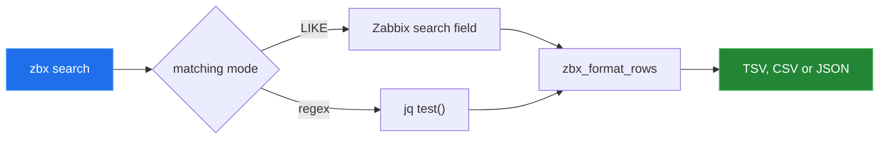

# Command surface

[← back to the overview](../README.md)

This table is generated from the `Usage:` and description blocks in `bin/zbx-*`
source files by [`devtools/generate-command-table.sh`](../devtools/generate-command-table.sh).

| Group | Command | Source | Usage | Description |
|---|---|---|---|---|
| Problems & triggers | `ack` | [`zbx-ack`](../bin/zbx-ack) | `zbx ack <eventid> [message]` | Acknowledge a problem (event) and optionally add a message. |
| Low-level | `call` | [`zbx-call`](../bin/zbx-call) | `zbx call <method> [jq-filter]` | Low-level JSON-RPC invoker that reads params JSON on stdin and prints results. |
| Configuration | `config` | [`zbx-config`](../bin/zbx-config) | `zbx config <subcommand> [...]` | Manage configuration and overrides for zbx. |
| Discovery & inventory | `discovery` | [`zbx-discovery`](../bin/zbx-discovery) | `zbx discovery <host>` | Show LLD discovery items for a host. |
| Auth & health | `doctor` | [`zbx-doctor`](../bin/zbx-doctor) | `zbx doctor [--fix] [--yes] [--json]` | Environment and config checks with optional fixes. |
| Items, history & trends | `history` | [`zbx-history`](../bin/zbx-history) | `zbx history <itemid> <since-epoch> <until-epoch>` | Fetch numeric history to TSV. |
| Hosts | `host-create` | [`zbx-host-create`](../bin/zbx-host-create) | `zbx host-create <host> <ip> [group]` | Create an agent host (IPv4) in a group. |
| Hosts | `host-del` | [`zbx-host-del`](../bin/zbx-host-del) | `zbx host-del <host>` | Delete a host by name. |
| Hosts | `host-disable` | [`zbx-host-disable`](../bin/zbx-host-disable) | `zbx host-disable <host>` | Disable a host. |
| Hosts | `host-enable` | [`zbx-host-enable`](../bin/zbx-host-enable) | `zbx host-enable <host>` | Enable a host. |
| Hosts | `host-get` | [`zbx-host-get`](../bin/zbx-host-get) | `zbx host-get <host>` | Show full JSON for a host, including interfaces, templates, and macros. |
| Hosts | `host-groups` | [`zbx-host-groups`](../bin/zbx-host-groups) | `zbx host-groups` | List host groups. |
| Hosts | `hosts-list` | [`zbx-hosts-list`](../bin/zbx-hosts-list) | `zbx hosts-list` | List hosts (hostid and host). |
| Discovery & inventory | `inventory` | [`zbx-inventory`](../bin/zbx-inventory) | `zbx inventory` | Export host inventory as CSV to stdout. |
| Items, history & trends | `item-find` | [`zbx-item-find`](../bin/zbx-item-find) | `zbx item-find <host> <item-key-exact>` | Find items by exact key on a host. |
| Auth & health | `login` | [`zbx-login`](../bin/zbx-login) | `zbx login` | Ensure a valid API session by performing user.login if needed. |
| Macros | `macro-bulk-set` | [`zbx-macro-bulk-set`](../bin/zbx-macro-bulk-set) | `cat macros.tsv \| zbx macro-bulk-set` | Bulk set host macros from TSV input. |
| Macros | `macro-del` | [`zbx-macro-del`](../bin/zbx-macro-del) | `zbx macro-del <host> <{MACRO}>` | Delete a macro on a host. |
| Macros | `macro-get` | [`zbx-macro-get`](../bin/zbx-macro-get) | `zbx macro-get <host>` | List macros for a host. |
| Macros | `macro-set` | [`zbx-macro-set`](../bin/zbx-macro-set) | `zbx macro-set <host> <{MACRO}> <value>` | Set or update a macro on a host. |
| Maintenance | `maint-create` | [`zbx-maint-create`](../bin/zbx-maint-create) | `zbx maint-create <name> <host> <since-epoch> <until-epoch>` | Create a maintenance window for a host. |
| Maintenance | `maint-del` | [`zbx-maint-del`](../bin/zbx-maint-del) | `zbx maint-del <maintenanceid>` | Delete a maintenance window by ID. |
| Maintenance | `maint-list` | [`zbx-maint-list`](../bin/zbx-maint-list) | `zbx maint-list` | List maintenance windows. |
| Auth & health | `ping` | [`zbx-ping`](../bin/zbx-ping) | `zbx ping` | Lightweight API health check. |
| Problems & triggers | `problems` | [`zbx-problems`](../bin/zbx-problems) | `zbx problems` | List current problems (recent=true) as TSV. |
| Search | `search` | [`zbx-search`](../bin/zbx-search) | `zbx search <entity> <pattern> [options]` | Search Zabbix entities (LIKE by default). |
| Templates | `template-link` | [`zbx-template-link`](../bin/zbx-template-link) | `zbx template-link <host> <template-name>` | Link a template to a host. |
| Templates | `template-list` | [`zbx-template-list`](../bin/zbx-template-list) | `zbx template-list` | List templates. |
| Templates | `template-unlink` | [`zbx-template-unlink`](../bin/zbx-template-unlink) | `zbx template-unlink <host> <template-name>` | Unlink a template from a host. |
| Items, history & trends | `trends` | [`zbx-trends`](../bin/zbx-trends) | `zbx trends <itemid> <since-epoch> <until-epoch>` | Fetch numeric trends to TSV. |
| Problems & triggers | `trigger-disable` | [`zbx-trigger-disable`](../bin/zbx-trigger-disable) | `zbx trigger-disable <triggerid>` | Disable a trigger by ID. |
| Problems & triggers | `trigger-enable` | [`zbx-trigger-enable`](../bin/zbx-trigger-enable) | `zbx trigger-enable <triggerid>` | Enable a trigger by ID. |
| Problems & triggers | `triggers` | [`zbx-triggers`](../bin/zbx-triggers) | `zbx triggers <host>` | List triggers for a host. |
| Auth & health | `version` | [`zbx-version`](../bin/zbx-version) | `zbx version` | Show API version and current user. |

`lib` is intentionally omitted: `bin/zbx-lib` is a sourced library, not a user
command. The dispatcher also contains the `call` path inline for piped JSON,
while the matching `bin/zbx-call` file provides the same command as an
installable subcommand.
