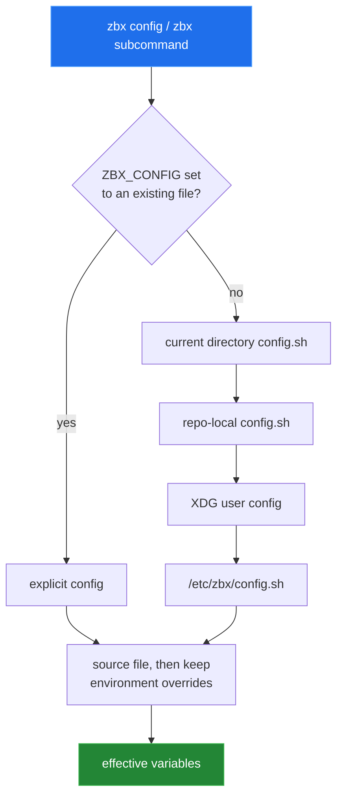
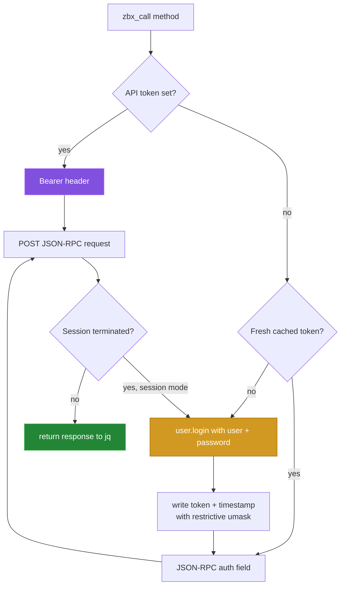

# Configuration and authentication

[← back to the overview](../README.md)

Configuration is shell syntax loaded by the client. Environment variables can
override values from a file, and `zbx config` writes a managed override block
without rewriting the rest of that file.

## Configuration variables

| Variable | Meaning | Default or behavior |
|---|---|---|
| `ZBX_CONFIG` | Explicit config path. | Used when the path exists. |
| `ZABBIX_URL` | JSON-RPC API endpoint. | The config skeleton supplies the example endpoint. |
| `ZABBIX_USER` / `ZABBIX_PASS` | Credentials for session authentication. | Used when `ZABBIX_API_TOKEN` is empty. |
| `ZABBIX_API_TOKEN` | Static API token. | Uses `Authorization: Bearer`; no session file is read or written. |
| `ZABBIX_VERIFY_TLS` | TLS verification switch. | `1` verifies certificates; `0` passes `--insecure` to `curl`. |
| `ZABBIX_CA_CERT` / `ZABBIX_CA_PATH` | Custom certificate file or certificate directory. | Applied while TLS verification is enabled. |
| `ZABBIX_TOKEN_FILE` | Cached session-token JSON file. | Defaults below the XDG state directory. |
| `ZABBIX_SESSION_TTL` | Session-token lifetime in seconds. | The library default is `1800`; expired JSON tokens trigger login. |
| `ZABBIX_CURL_TIMEOUT` | Both connect and maximum request timeout. | The library default is `25` seconds. |
| `LOG_LEVEL` / `LOG_FILE` | Logging verbosity and optional destination. | Logs go to stderr; debug output requires `LOG_LEVEL=debug`. |

The config command supports `list`, `get`, `set`, `unset`, `init`, `edit`, and
`path`. Its `auto` scope writes to the current directory when writable and
otherwise uses the user config directory. `get` and `list` redact the password
and API token unless `--raw` is requested.

## Authentication path

`apiinfo.version` bypasses this decision and is sent without auth. All other
API methods use the token mode or session mode shown above. A session-expired
response causes one re-login and one retry; the command does not loop forever.
