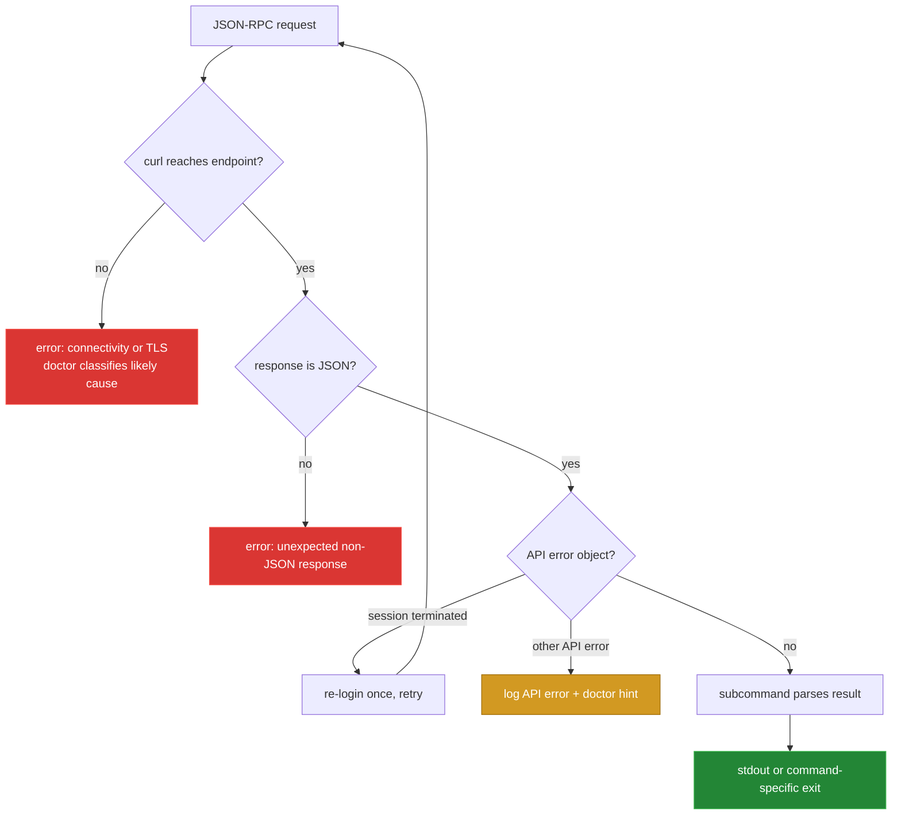

# Failure modes

[← back to the overview](../README.md)

The client keeps transport failures, authentication failures, and API-level
errors visible in stderr. `zbx doctor` adds endpoint diagnostics for common
DNS, TLS, HTTP, and response-shape problems.

## What each failure looks like

| Condition | Client behavior | Where to look next |
|---|---|---|
| Login returns no token or an API error | `zbx_login` logs `Zabbix login failed` with the structured error and returns failure. | Check credentials, token mode, and `zbx doctor`. |
| Session is terminated during a call | The library logs a warning, performs one login, and retries the original request once. | Check the token file and session lifetime if the retry also fails. |
| DNS, connection, timeout, or TLS failure | `curl` failure is reported as an HTTP request failure. | Run `zbx doctor`; use `ZABBIX_CA_CERT`, `ZABBIX_CA_PATH`, or the one-shot `--insecure` flag only when appropriate. |
| HTTP response is not JSON | The call reports an unexpected non-JSON response and points to URL/TLS/auth checks. | Confirm the URL ends at the Zabbix `api_jsonrpc.php` endpoint. |
| JSON-RPC response contains another API error in session mode | The structured error is logged and the response is passed back to the command. | Inspect the API error and the command parameters. |
| JSON-RPC response contains an error in API-token mode | The early token-mode return bypasses the structured error check; callers can treat the response as successful. | See [bugs found](BUGS-FOUND.md); validate the raw JSON until this is fixed. |
| `apiinfo.version` is unavailable or has an unexpected value | There is no semantic version gate in the client. `zbx ping` checks whether the call returns; `zbx version` prints the returned `.result` and then queries `user.get`. | Treat the result as an endpoint diagnostic, not a compatibility proof; use `zbx doctor` and the integration tests against the target Zabbix version. |

The last row is deliberate documentation of current behavior: the source does
not compare the reported API version against a supported range. A syntactically
valid but semantically unsuitable response is therefore not rejected by a
version check.

When the endpoint cannot be reached, `zbx doctor` also has a formatting bug in
its deep probe: the unavailable HTTP marker can be duplicated as `000000`.
This is recorded with a reproduction and proposed diff in
[bugs found](BUGS-FOUND.md).

## Exit status and output

Argument and option errors are rejected by the individual subcommands before a
request is made. API-facing commands generally preserve the JSON response for
inspection while logging diagnostics to stderr. The exact final exit status can
also depend on the consuming `jq` pipeline, so scripts that need strict failure
handling should use `zbx call --raw` and validate the JSON-RPC envelope.
