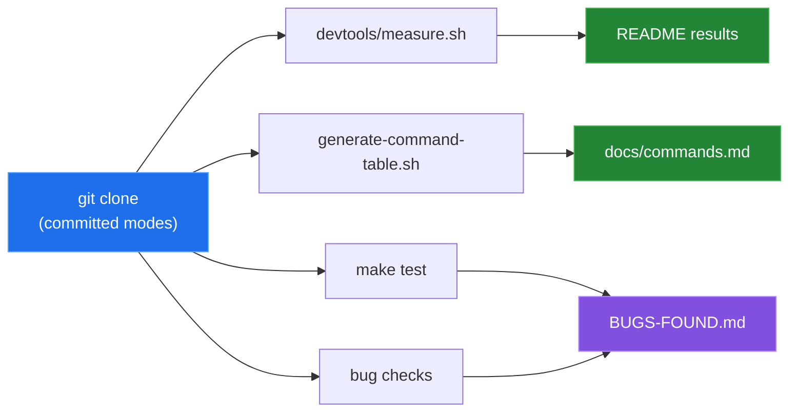

# Measurement and provenance

[← back to the overview](../README.md)

Every number in this documentation comes from one script run in a Linux
container:

```sh
sh devtools/linux-run.sh > docs/captures/linux-run.txt
```

[`devtools/linux-run.sh`](../devtools/linux-run.sh) starts
`python:3.12-slim-bookworm`, installs curl, jq, make and git, and runs
`git clone` on the read-only mounted repository, so the file modes are the
committed ones. No Zabbix endpoint is contacted. The full output is
[`captures/linux-run.txt`](captures/linux-run.txt); every block below is taken
from it.



## Environment

| | |
|---|---|
| Kernel | Linux 6.5.11-linuxkit, aarch64 (Docker Desktop VM) |
| Image | `python:3.12-slim-bookworm` (`sha256:392307d2…23564e`) |
| Tools | GNU bash 5.2.15, curl 7.88.1, jq 1.6 |
| Date | 2026-09-24 |

## Repository snapshot

`devtools/measure.sh`:

| Measurement | Value |
|---|---:|
| User-facing command source files | 34 |
| Bytes in those command files | 59,770 |
| Lines in those command files | 1,755 |
| Bytes in all `bin/*` files | 79,093 |
| Lines in all `bin/*` files | 2,351 |
| Shell test files | 12 |

## Command table

`devtools/generate-command-table.sh` reads each `bin/zbx-*` file, skips the
sourced `zbx-lib`, and extracts the first `Usage:` line and description. All
36 table rows it generates are present in [`commands.md`](commands.md).

## Tests

`make test` runs every `tests/test_*.sh`. In a fresh clone:

```
Summary: 1 passed, 11 failed
```

Nine mock tests exit 126 because the files in `bin/` are committed without
the executable bit (entry 6 in [bugs found](BUGS-FOUND.md)). After
`chmod +x bin/*`:

```
FAIL tests/test_integration_connectivity.sh (exit 1)
FAIL tests/test_integration_readonly.sh (exit 1)
FAIL tests/test_search.sh (exit 1)
Summary: 9 passed, 3 failed
```

The two integration tests need `ZABBIX_URL` and a reachable endpoint and stop
early without one, by design:

```
ERROR: ZABBIX_URL must be set for integration connectivity tests
```

`test_search.sh` fails because it starts a login shell that resets `PATH`
(entry 7).

To run the integration tests against a server:

```sh
ZABBIX_URL=https://zabbix.example.com/api_jsonrpc.php \
  ZABBIX_API_TOKEN=... make test
```

The integration suite is read-only.

## Fixed bugs

The script also checks each fixed entry in [bugs found](BUGS-FOUND.md):

| Entry | Result |
|---|---|
| 1. Internal library listed | `commands listed: 34, lib listed: 0` after `make install` |
| 3. Mock curl | `-rwxr-xr-x`, and `command -v curl` resolves to `tests/mock-bin/curl` |
| 4. Token-mode API error | `zbx-ping` and `zbx-version` exit 1 and log `API error: ...` |
| 5. `000000` marker | doctor against `127.0.0.1:9` prints the network message; no `000000` |

## Not covered

No live Zabbix endpoint was available, so there is no network latency,
throughput, API-compatibility or live command result. The Mermaid diagrams
describe the source; they are not captured program output.
