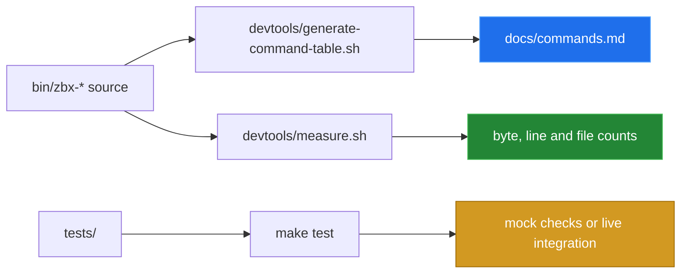

# Measurement and provenance

[← back to the overview](../README.md)

The documentation numbers in this pass are repository measurements, not
estimates. The scripts that produce them are committed in `devtools/` because
`tools/` already contains the repository's own completion generator.



## Repository snapshot

Run from the repository root:

```sh
devtools/measure.sh
```

The values below are the output of that command on the committed documentation
snapshot:

| Measurement | Value | Producer |
|---|---:|---|
| User-facing command source files | 34 | `devtools/measure.sh` |
| Bytes in those command files | 59,733 | `devtools/measure.sh` |
| Lines in those command files | 1,754 | `devtools/measure.sh` |
| Bytes in all `bin/*` files | 79,036 | `devtools/measure.sh` |
| Lines in all `bin/*` files | 2,348 | `devtools/measure.sh` |
| Shell test files | 12 | `devtools/measure.sh` |

The command table is regenerated with:

```sh
devtools/generate-command-table.sh
```

It reads each `bin/zbx-*` file, skips the sourced `zbx-lib`, and extracts the
first `Usage:` line and the first description line. It does not invoke a live
Zabbix endpoint.

## Tests and network boundary

The repository has mock-based shell tests and two integration test scripts.
The integration scripts intentionally require `ZABBIX_URL`, credentials or an
API token, and a reachable endpoint. No live Zabbix endpoint was available for
this documentation pass, so no network latency, throughput, API compatibility,
or live command-result number is published.

For the same reason, this pass ships Mermaid diagrams only. It does not ship a
GIF or terminal recording: the project cannot be honestly recorded without a
real API run, and mock output is not presented as one.

When a live endpoint is available, run the read-only checks explicitly:

```sh
ZABBIX_URL=https://zabbix.example.com/api_jsonrpc.php \
  ZABBIX_API_TOKEN=... make test
```

The integration suite is read-only; the mock suite also exercises formatting,
dispatch, config editing, and doctor output. Do not treat an unconfigured
integration run as a product failure: it is a missing measurement boundary.
In this checkout, the mock suite also exposes the tracked non-executable mock
`curl` issue documented in [bugs found](BUGS-FOUND.md), so `make test` is not
reported as a clean pass here.
